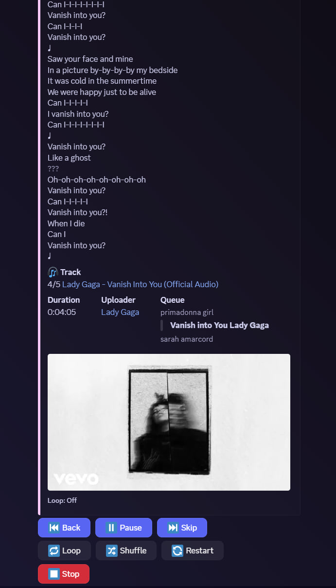

<h1 align="center">Advanced Discord Music Bot</h1>
A Discord Music Bot that can reproduce audio from many sources, including YouTube and support for Spotify, features a very nice "in-message UI" and does not spam your voice channel with thousands of messages, it only sends one message the first time it is invoked and keeps editing that, using it as a player.
This bot is not lightweight and meant to be as fancy as possible, so it is reccomended to only run it in a few servers at a time

<p align="center">
  
</p>

#  **🎧 Features**
- YouTube and Spotify support (plus many more such as Tidal, Deezer, SoundCloud...)
- Support for playlists
- Command-less, use the in-message player to control it.
- Lyrics support
- Discord slash command support
- Loop, Shuffle or Restart your songs
- No message spamming, everything is done in one compact embed

# **⚙️ Set up** 
Installation of ``Python 3.12+``, a ``Discord Bot Token`` and ``Spotify API Key (for Spotify Support)`` are required. <br>
All the dependencies are listed in requrements.txt, to install them run:
 
```
pip install -r requirements.txt
```
##  **🔑 API Keys**
You have to create your own discord Bot and store your Bot Token 
 * Your Discord Application - [Discord](https://discord.com/developers)
 * You own Spotify Keys - [Spotify](https://developer.spotify.com/dashboard/applications)

    - This information must be stored in the .env file.

##  **Installation of FFMPEG**<br>
FFMPEG is a module that will be used to play music, you must have this configured in your machine
*FFMPEG must be configured in the PATH for Windows users. Check this [YoutubeVideo](https://www.youtube.com/watch?v=r1AtmY-RMyQ&t=114s&ab_channel=TroubleChute).* <br><br>
You can download the executables in this link `https://www.ffmpeg.org/download.html` and then put the .exe files inside a ffmpeg\bin folder in your C:\ folder. Do not forget to add 'ffmpeg\bin' to your PATH.

## **.Env File**
For the bot to work, you need to create a ``.env`` file in the same directory and put all the required API Keys there
Example:
```env
BOT_TOKEN = YOUR_DISCORD_BOT_TOKEN
SPOTIFY_ID=YOUR_SPOTIFY_ID
SPOTIFY_SECRET=YOUR_SPOTIFY_SECRET
```

## 🖥️ Usage
It is reccomended to create a Text Channel just for this bot so the player always stays visible.
Just use /play to start and everything else will come intuitevely, it is just like using a generic media player from an app.

## 📖 License
This program is free software: you can redistribute it and/or modify it under the terms of the [MIT License](https://github.com/RafaelSolVargas/Vulkan/blob/master/LICENSE).

## 🔨 TODO
- Multi-bot suopport if you have 2 istances of this bot in your server, if someone in another channel uses /play another bot will join and listen to their commands
